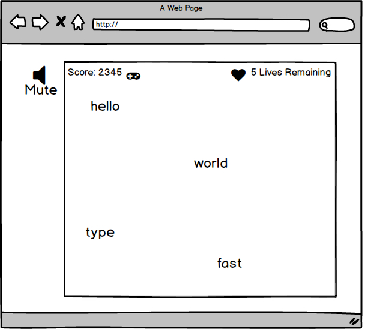

# Falling-Words

### Background

Falling Words is an educational app used to allow users to gamify practicing ones typing skills. The app will be created using HTML/CSS and vanilla JavaScrip. The game is simple, yet engaging. Players type words before they fall to the bottom of the screen. If the player types the word correctly, he or she is awarded points. The game increases in speed as more words are answered correctly.

### Functionality & MVP

With Falling Words, users will be able to:

- [ ] Start, play, and restart the game on loss
- [ ] Type words and phrases before they hit the bottom of the screen
- [ ] Be awarded points for correct answers and have lives deducted for failures
- [ ] Difficulty increases as the game progresses

In addition, this project will include:

- [ ] A production README

### Wireframes

This app will have a single screen that is comprised of the game screen , game controls, and nav links. Users will type words using the keyboard and the words will disappear from the screen upon completion.

This project will be implemented with the following technologies:

- Vanilla JavaScript for overall structure and logic,
- HTML/CSS for rendering and graphics
- HTML5 Canvas for DOM manipulation and rendering,
- Webpack to bundle and serve up the various scripts.

Additionally, various scripts will be involved in this project including:

- `target.js` will handle the logic common to all falling words
- `environment.js` will be responsible for animations and screen rendering
- `game.js` will handle the game logic and increasing the difficulty as the player progresses

### Implementation Timeline

**Day 1**: Setup all necessary Node modules, including getting webpack working. Goals for the day:

- Create the main playing field and be able to generate words

**Day 2**: Finish setting up word difficulty logic for increasing levels

- Words can fall simultaneously, at increasing speeds

**Day 3**: Keep track of accumulating score and lives through iterations. Goals for the day:

- Use recursion to increase the interval while preserving the state of the game - score and lives remaining
- Accurately tally and display the players ever changing score

**Day 4**: Style game and make it look nice. Goals for the day:

- Player can type words to neutralize them and is awarded points accurately
- Style the game well to make it intuitive and enjoyable

### Bonus Features

- [ ] A version for keyboard shortcuts
- [ ] A math version in which small math problems drop (e.g. "5 x 4")
