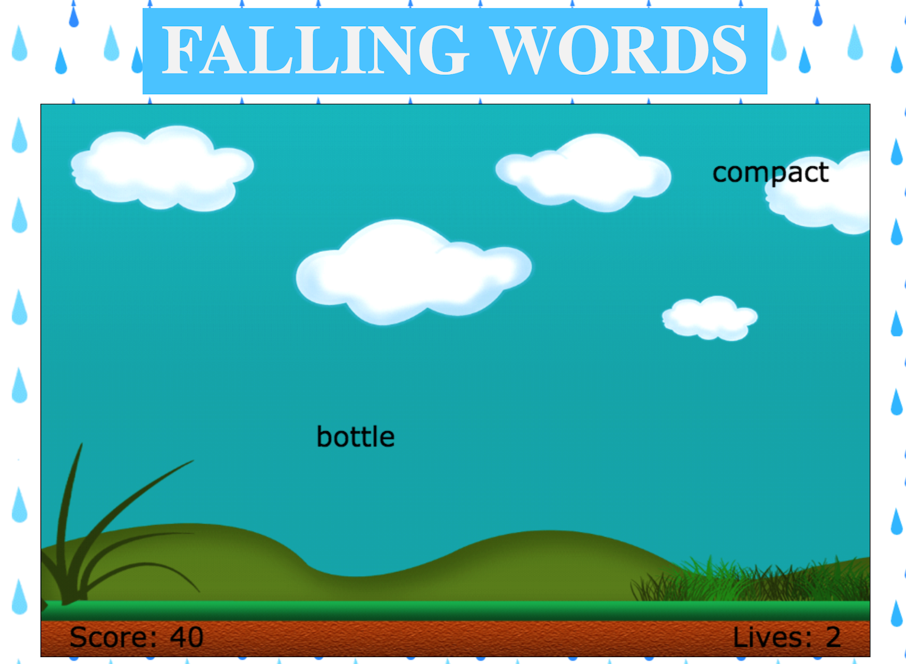

# Falling Words

A game to increase one's typing speed while having fun!

[live link](https://rrolfes.github.io/Falling-Words/)

## Overview

_Falling Words_ is a very intuitive game. It's simplicity and challenging nature make the game for all ages and extremely addicting.

A player is given three lives at the start of the game. Words immediately start falling from the top of the screen and the player must type them in correctly and hit enter to solve the word. If he or she answers the word correctly before it hits the bottom of the screen, ten points are awarded and the word disappears. If he or she does not answer the word correctly before it hits the bottom of the screen, a life id deducted. With each correctly answered word, the game gets a little bit harder!

## Functionality

The game works by listening to the keys the user types in and comparing them to the target words that are on the screen.

A player can see the keys he or she has pressed upon pressing any letter on the keyboard.

If the player needs to delete a letter, he or she can by pressing backspace.

Words are random words are generated at the top of the screen and fall naturally down the page.

The word generation speed increasing via a recursive call, which increases the word generation speed based on the players score, while being sure to preserve the player's current score and number of lives.

If the player loses all of his or her lives, he or she is prompted to restart the game via pressing the space bar.

## Screenshot

## Technologies Used

- Vanilla JavaScript was used for the structure and logic of this project
- HTML5 canvas was used for the animation and setup of the game
- JavaScript files were bundled using Webpack
- No additional libraries were implemented
